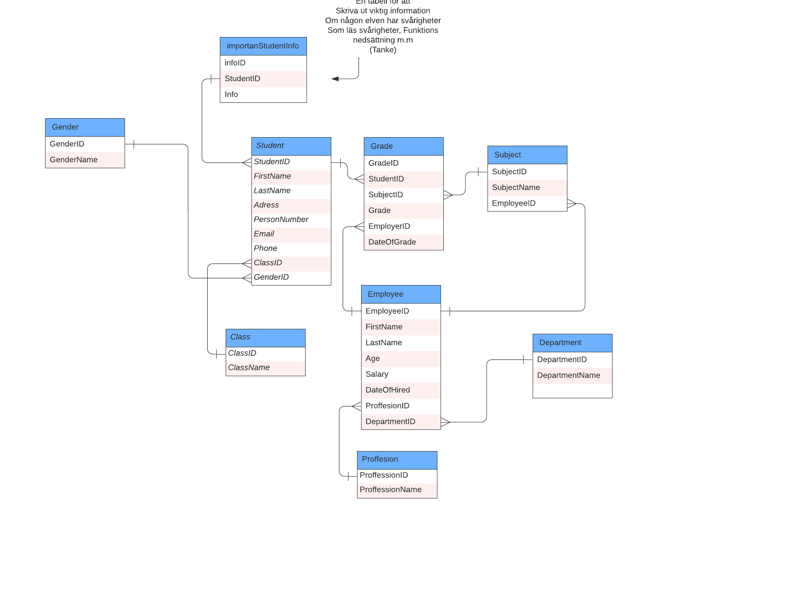

# Individuellt-databasprojekt

# Funktioner i programmet:


Här följer de funktioner du ska bygga i ditt program.

```bash
 Det måste finnas en meny där man kan välja att visa olika data som efterfrågas av skolan. (Console)
````
```bash
 Skolan vill kunna ta fram en översikt över all personal där det framgår namn och vilka befattningar de har samt hur många år de har arbetat på skolan. Administratören vill också ha möjlighet att spara ner ny personal. (SQL i SSMS)
````
```bash
 Vi vill spara ner elever och se vilken klass de går i. Vi vill kunna spara ner betyg för en elev i varje kurs de läst och vi vill kunna se vilken lärare som satt betyget. Betyg ska också ha ett datum då de satts. (SQL i SSMS)
```
```bash
 Hur många lärare jobbar på de olika avdelningarna? (EF i VS)
````
```bash
 Visa information om alla elever (EF i VS)
````
```bash
 Visa en lista på alla aktiva kurser (EF i VS)
````
```bash
 Hur mycket betalar respektive avdelning ut i lön varje månad? (SQL i SSMS)
````
```bash
 Hur mycket är medellönen för de olika avdelningarna? (SQL i SSMS)
```
```bash
 Skapa en Stored Procedure som tar emot ett Id och returnerar viktig information om den elev som är registrerad med aktuellt Id. (SQL i SSMS)
 ````
```bash

 Sätt betyg på en elev genom att använda Transactions ifall något går fel. (SQL i SSMS)
 ```

 # Modellering 
 
 
 
